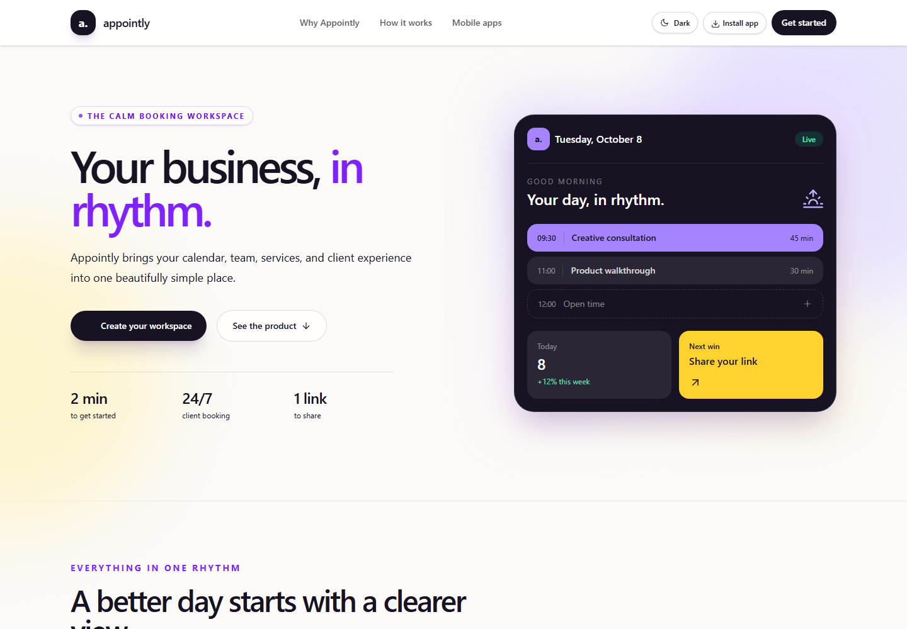
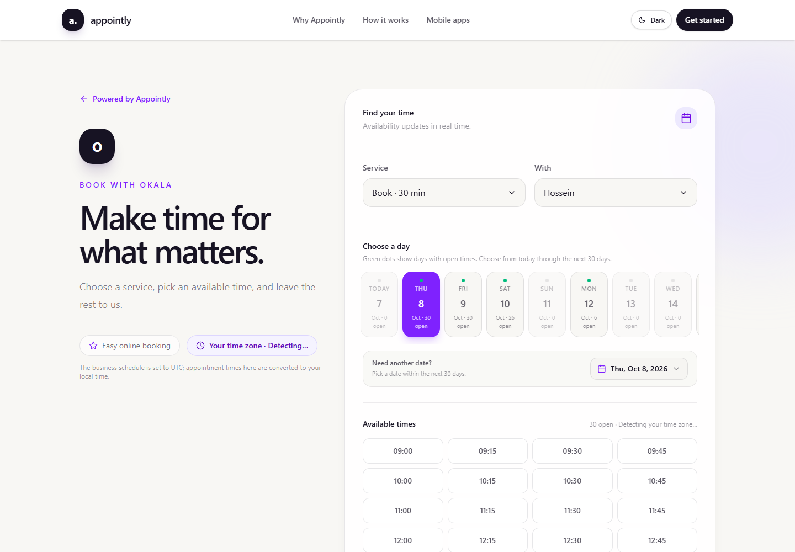

# Appointly

Appointly is a multi-tenant appointment-booking application for service businesses. It brings public booking, team availability, appointment operations, customer history, and workspace reporting into one Laravel application.

The web workspace is the primary product. A versioned REST API keeps future Kotlin Multiplatform clients independent from Blade and Livewire.

## Screenshots

### Marketing site



### Public booking



## What’s included

- Public booking pages with service and bookable-team selection, timezone-aware availability, a 30-day booking window, and conflict-safe appointment requests.
- Authenticated workspace pages for overview, calendar, appointments, services, team, customers, reports, and settings.
- Tenant-scoped appointment transitions, customer history, schedule exceptions, working hours, and service assignments.
- Public appointment lookup, cancellation, and rescheduling flows using opaque booking tokens.
- Session authentication for the web app, Google sign-in, and Sanctum tokens for the REST API.
- Workspace notifications, appointment email notifications, scheduled reminders, audit history, exports, API keys, and signed webhooks.
- Light and dark themes, responsive layouts, Livewire navigation, and an installable web-app manifest.

Billing, external calendar synchronization, multi-location businesses, and native Android/iOS clients are roadmap items, not current capabilities.

## Technology

- PHP 8.3+ and Laravel 13
- MySQL 8+
- Livewire 4 and Blade
- Laravel Sanctum and Socialite
- Tailwind CSS 4, Vite, Alpine.js, and Feather icons
- PHPUnit 12

## Get started

### Requirements

- PHP 8.3 or newer with the extensions required by Laravel and `pdo_mysql`
- Composer
- MySQL 8 or newer
- Node.js 22+ and npm

### Install

```bash
composer install
```

Copy `.env.example` to `.env`, then set the application URL and MySQL connection values (`DB_HOST`, `DB_PORT`, `DB_DATABASE`, `DB_USERNAME`, and `DB_PASSWORD`). Generate the application key and create the schema:

```bash
php artisan key:generate
php artisan migrate
npm install
npm run build
```

Start the Laravel server and the frontend development server in separate terminals:

```bash
php artisan serve
npm run dev
```

Open the application at the URL shown by `artisan serve`, register an owner account, and create a workspace. Add a service, a team member, an active service assignment, and working hours before testing public availability.

For appointment email delivery and reminders during local development, also run a queue worker and scheduler:

```bash
php artisan queue:work --tries=3
php artisan schedule:work
```

Configure Google OAuth credentials only if Google sign-in is needed. Configure a real mail transport for email delivery; the example environment uses the log mailer.

## Main routes

| Purpose | Route |
| --- | --- |
| Marketing site | `/` |
| Login and registration | `/login`, `/register` |
| Workspace overview | `/workspace/overview` |
| Public business booking | `/business/{tenant-slug}` |
| Public booking embed | `/embed/{tenant-slug}` |
| Versioned REST API | `/api/v1` |
| Liveness check | `/up` |
| Database readiness check | `/health/ready` |

Authenticated workspace URLs are tenant-scoped. `/dashboard` redirects to the workspace overview.

## REST API

The API is versioned under `/api/v1`. Authenticated requests use Sanctum bearer tokens and the authorized tenant context; public business and booking endpoints do not require authentication. Public availability and booking endpoints are rate-limited.

Common endpoints include:

```text
POST /api/v1/auth/register
POST /api/v1/auth/login
GET  /api/v1/auth/me
POST /api/v1/auth/logout

GET  /api/v1/public/businesses/{slug}
GET  /api/v1/public/businesses/{slug}/services
GET  /api/v1/public/businesses/{slug}/availability
POST /api/v1/public/businesses/{slug}/appointments
GET  /api/v1/public/appointments/{token}
```

The maintained API specification is in [`docs/api/openapi-v1.yaml`](docs/api/openapi-v1.yaml). See [`docs/api-contract.md`](docs/api-contract.md) for the API conventions and [`docs/kmp-client-guidance.md`](docs/kmp-client-guidance.md) for future client guidance.

## Architecture

Appointly is a pragmatic modular monolith with the dependency direction `Interfaces → Application → Domain`, with Laravel/Eloquent persistence and integrations in Infrastructure.

```text
app/
├── Domain/          # Framework-independent rules and value objects
├── Application/     # Booking, availability, and workspace use cases
├── Infrastructure/ # Eloquent persistence and external integrations
├── Http/            # API and web delivery concerns
└── Livewire/        # Workspace and public booking interfaces
```

The REST API is independent of the Livewire UI. Appointment creation revalidates availability in a database transaction and serializes reservations by staff and local business date.

## Tests and builds

Run the test suite and create production assets with:

```bash
php artisan test --compact
npm run build
```

Continuous integration runs the application tests against MySQL 8, including a simultaneous booking-conflict test, and builds the frontend assets. The race test is skipped in the default SQLite test setup; use a dedicated disposable MySQL test database to run it locally:

```bash
APPOINTLY_MYSQL_CONCURRENCY_TESTS=true php artisan test --compact --filter=MySqlConcurrentBookingTest
```

Never point the concurrency test at a production or user-data database.

## Production checklist

Before serving production traffic:

- Set `APP_ENV=production`, `APP_DEBUG=false`, and an HTTPS `APP_URL`; keep secrets in the deployment platform’s secret store.
- Configure MySQL, a production mail provider, and secure session cookies.
- Run migrations as a controlled release step and build assets with `npm run build`.
- Run a queue worker with retries and configure `schedule:run` every minute.
- Verify `/up` and `/health/ready`, monitor failed jobs, and enable database backups.
- Perform a test restore and confirm the backup retention and incident owner.
- Run dependency vulnerability checks in an environment with registry access.

Read the [deployment runbook](docs/deployment.md) and [product roadmap](docs/roadmap.md) before release. Production infrastructure, provider credentials, backup restoration, and monitoring must be verified in the target hosting environment; this repository cannot verify those external settings.
